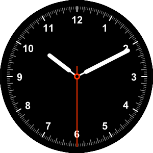

# Exemple Canvas JavaFX - Rellotge #

En aquest projecte hi ha un exemple de com dibuixar un rellotge al Canvas de JavaFX

### Compilació i funcionament ###

A Linux i OSX:

```
./run.sh
```

A Windows Powershell:

```
.\run.bat
```

### Llicència ###

Tenir en compte les llicències JavaFX que hi ha en cada una de les respectives carpetes

[JavaFX](https://openjdk.org/projects/openjfx/)

### Captura ###


